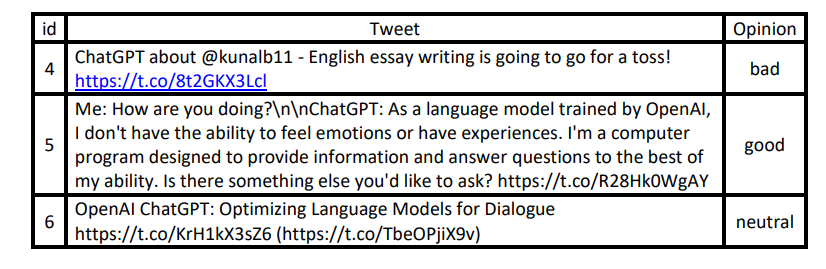

# ChatGPT_SentimentAnalysis
 
Given the dataset of several tweets about ChatGPT where users post their opinions towards it. This dataset gathered 219293 tweets for a 
month, which classifies each tweet into three classes (i.e., positive “good”, negative “bad”, or neutral) perform text classification using a machine learning classification model and word Embeddings.

### Dataset Preview:

||
|:-:|
